 

 

## About Me

I build systems at the intersection of **software, machine learning, and hardware** — from predictive models trained on real sensor data to computer vision systems designed for practical applications. I'm most interested in **AI/ML, computer vision, and intelligent systems that connect to the physical world through IoT**.

I'm currently strengthening my foundations in machine learning engineering and exploring how intelligent and agent-style architectures can be applied to real-world decision-support problems.

- 🔭 Working on intelligent, sensor-driven and vision-driven systems
- 🌱 Currently deepening my knowledge of ML model development, testing, deployment, computer vision, and embedded/IoT integration
- 🎯 Interested in: **AI/ML · Computer Vision · Industrial IoT · Intelligent Systems**
- 💼 Targeting: **AI/ML Engineer · Software Engineer**
- 📍 Based in Dharmapuri, India

 

## Tech Stack

<table width="100%">
<tr>
<td valign="top" width="50%">

**Languages**
 

</td>
<td valign="top" width="50%">

**AI / ML**
 

 

</td>
</tr>
<tr>
<td valign="top">

**Computer Vision**
 

 

</td>
<td valign="top">

**IoT / Edge**
 

 

</td>
</tr>
<tr>
<td valign="top">

**Backend / App Layer**
 

 

</td>
<td valign="top">

**Tools / Platforms**
 

</td>
</tr>
</table>

> Stack reflects technologies demonstrated in shipped repositories. Skills currently studied but not yet reflected in a project are listed under *Currently Exploring* below, not here.

 

## Featured Projects

<table width="100%">
<tr>
<td width="50%" valign="top">
<h3>🏭 AI-Powered Industrial Safety Intelligence System</h3>

Predictive safety platform for industrial environments — fuses machine and environment sensor data with a Random Forest risk model to flag hazardous conditions before thresholds are breached, instead of alerting only after the fact.

**Built with:** Python · ESP32 · MQTT (Paho / Mosquitto) · Random Forest · HTML Dashboard

- Dual-node IIoT architecture (Machine Safety AI + Environment Safety AI feeding a Master Safety AI)
- Real-time NORMAL / CAUTION / DANGER risk classification
- Live dashboard with machine risk, environment risk, and factory health score

Built as part of an Industrial IoT & AI internship/team project.

**My Contribution:** Worked on the main AI/ML components and contributed to hardware integration, including sensor data processing, machine-learning-based risk prediction, and the intelligent safety pipeline.

</td>
<td width="50%" valign="top">
<h3>🚗 Vehicle Type Classification (CNN + MobileNetV2)</h3>

Image-based vehicle classifier distinguishing Car / Bike / Bus / Truck / Ambulance using transfer learning, wrapped in a confidence-based decision layer (High Confidence / Needs Review / Uncertain) with special emphasis on ambulance detection for emergency-response use cases.

**Built with:** Python · TensorFlow/Keras · MobileNetV2 · OpenCV · Streamlit

- Transfer learning on MobileNetV2 with a custom classification head
- Rule-based confidence layer on top of raw softmax output
- Streamlit demo app for image upload / live camera inference

Co-developed with a 4-person team as an academic project.

**My Contribution:** Contributed to dataset collection and model testing, including evaluating the classification system across vehicle categories.

</td>
</tr>
</table>

 

## Currently Exploring

> These are directions I'm actively studying, drawn from the "Future Enhancements" of my existing projects — not finished builds.

- **Edge AI / TinyML** — moving inference from server-side Python onto ESP32-class hardware
- **Computer-vision-based safety detection** — extending the Industrial Safety AI system with a vision layer
- **Real (LLM-backed) agentic systems** — moving from the simulated agent pattern in AgentBuy toward genuine tool-using agents

 

## GitHub Analytics

  
  

 

## Contribution Activity

<picture>
  <source media="(prefers-color-scheme: dark)" srcset="https://raw.githubusercontent.com/SUMANTRAJ-B/SUMANTRAJ-B/output/github-contribution-grid-snake-dark.svg" />
  <source media="(prefers-color-scheme: light)" srcset="https://raw.githubusercontent.com/SUMANTRAJ-B/SUMANTRAJ-B/output/github-contribution-grid-snake.svg" />
  
</picture>

  

## Connect With Me

  

